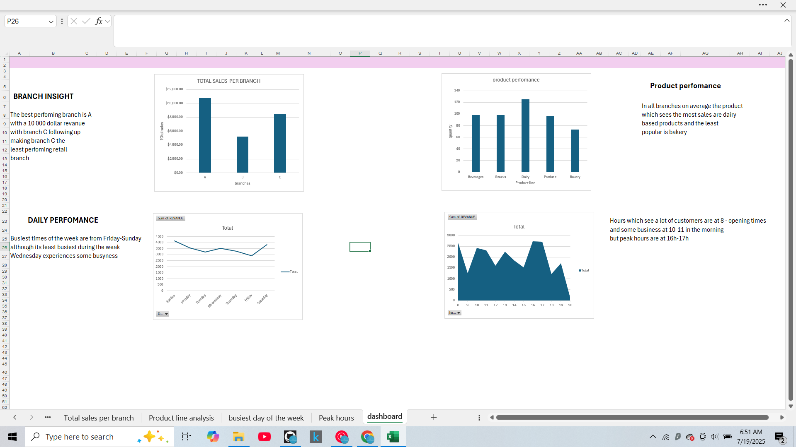

📊 Retail Sales Dashboard (Excel)
This project analyzes a fictional retail franchise’s 4-month sales data using Excel. The goal was to extract KPIs and visualize performance to help business owners track growth and revenue trends.

## 📂 Dataset Overview:

The dataset includes sales records with the following key fields:

| Column Name       | Description                                |
|-------------------|--------------------------------------------|
| `Date`            | Date of the transaction                    |
| `Branch`          | Store location (A, B, or C)                |
| `Customer Type`   | Member or Normal customer                  |
| `Gender`          | Gender of the customer                     |
| `Product Line`    | Category of the item sold                  |
| `Total`           | Total revenue of the transaction           |
| `Payment`         | Method used (Cash, Credit card, Ewallet)   |

---
## 📊 Business Questions Answered:

- What product lines generate the most revenue?
- What are the busiest times of day or days of the week?
- Do member customers spend more than normal ones?
- Which branches outperform others?

## 💡 Key Insights:

- 🥇 **Top Product Line**: [DAIRY]
- 🕒 **Peak Sales Hours**: [10 AM- 5PM]
- 📍 **Best Performing Branch**: [A]

## ✅ Key KPIs Covered:
-Revenue contribution by product category
-Sales volume trends across weekdays and weekends
-Hourly revenue analysis to identify staffing windows
-Monthly revenue accumulation across branches

## 📁 Tools Used:

-Excel Pivot Tables
-Pivot Charts
-Conditional Formatting

## 🛠️ Steps Taken:

-Cleaned raw dataset and removed duplicates
-Created new columns (e.g., Hour from datetime)
-Built PivotTables for product, time, and branch-level analysis
-Visualized key metrics in dashboard layout

## 📁 Files

- `retail_data.xlsx` — cleaned and analyzed dataset
- `dashboard.png` — Excel visualization of key metrics
- `README.md` — this documentation file

## 🎯 Business Goal:
-Help retail owners identify when and where they’re making the most money so they can:
-Optimize staffing
-Manage stock better
-Target high-performing products

## 🧠 Insights:
-Saturday, Sunday, and Wednesday consistently showed higher revenue across all branches, especially between 10AM–5PM. ideal for promotions and staffing.
-Dairy generated the highest revenue despite lower transaction volume, indicating a high-margin product category
-Lowest performing days were consistent ( Mondays & Fridays ) — potential for cost-cutting or promotions

## conclusion
This analysis would help a retail franchise optimize shift scheduling, stock procurement, and targeted promotions by understanding transaction behavior.

## Dashboard screanshot:

## Future Improveents
 Include dynamic dashboards (Power BI or Google Data Studio)
Add forecasting (simple linear regression or moving average)
Automate weekly reports using Excel macros or Python
 

## Next Steps
This project is one of several in an ongoing analytics portfolio. The goal is to build towards more advanced business intelligence and financial modeling projects, using tools like SQL, Python, and Power BI in the near future.
## 👤 Author

**Bayanda Nkosi**  
Aspiring data-driven investor and freelance business analyst.
Reach me via [LinkedIn](https://www.linkedin.com/in/bayanda-nkosi-50a292317/)
